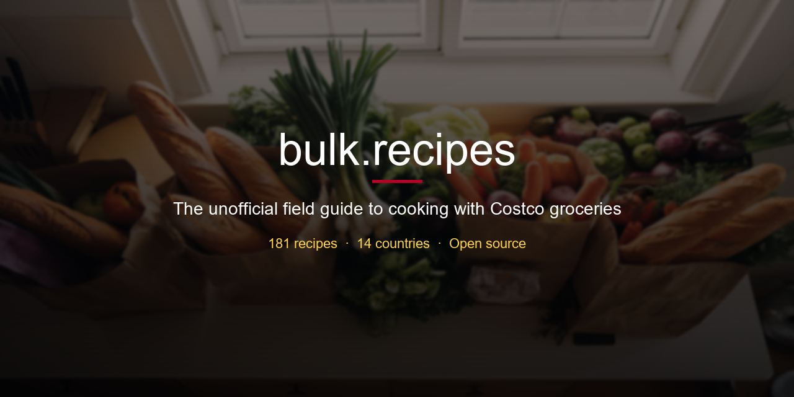

  

  
  
  
  

> The unofficial field guide to feeding yourself (and probably 12 other people) with Costco groceries.

You walked in for paper towels. You left with a rotisserie chicken, 5 lbs of salmon, and a vague plan to "meal prep this week." We've all been there. This repo is here to help.

No web app. No framework. Just organized markdown files you can browse right here on GitHub — or visit **[bulk.recipes](https://bulk.recipes)** for the full experience.

---

## What's Here

### [Costco Groceries](products/)

The raw materials. Bulk chicken, industrial-sized olive oil, eggs by the metric ton. Organized by category so you can figure out what to actually do with all of it.

[Meat & Poultry](products/meat-and-poultry.md) ·
[Seafood](products/seafood.md) ·
[Dairy & Eggs](products/dairy-and-eggs.md) ·
[Pantry Staples](products/pantry-staples.md) ·
[Frozen](products/frozen.md) ·
[Produce](products/produce.md) ·
[Kirkland Signature Hits](products/kirkland-signature.md)

### [Costco Prepared Foods](prepared/)

What Costco already cooked for you — food court menus, deli meals, and bakery items from all 14 countries where Costco operates. Somebody in Japan is eating a bulgogi bake right now and honestly that's beautiful.

Highlights:
- The **$1.50 hot dog combo** that hasn't changed price since 1985
- Japan's bulgogi bake, sushi platters, and matcha cakes
- Korea's tteokbokki, pork bake, and Korean fried chicken
- China's truffle pizza, Peking duck rolls, and earl grey soft serve
- Mexico's torta al pastor and cochinita pibil
- France's croque monsieur, duck confit, and canelés
- Iceland's single warehouse absolutely vibing with gelato and Icelandic hot dogs

**[Browse all 14 countries →](prepared/)**

### [Recipes](recipes/)

What you make at home with all that stuff. 181 homemade recipes built around Costco ingredients, each with a Costco shopping list and cost-per-serving breakdown.

A few favorites:
- [Birria Tacos](recipes/weeknight-dinners/birria-tacos.md) — slow-braised chuck roast, crispy dipped tacos — $3.50/serving
- [Baby Back Ribs](recipes/grilling/baby-back-ribs.md) — dry-rubbed, low and slow, worth the wait — $4.50/serving
- [Pad Thai](recipes/weeknight-dinners/pad-thai.md) — shrimp, rice noodles, peanuts, tamarind — $3.50/serving
- [Chicken & Wild Rice Soup](recipes/soups/chicken-wild-rice-soup.md) — rotisserie chicken in creamy broth — $2.25/serving
- [Seared Scallops](recipes/weeknight-dinners/seared-scallops.md) — restaurant-quality, screaming hot pan — $8.00/serving
- [Churros](recipes/costco-copycats/food-court/churros.md) — reverse-engineered from the food court — $0.42/serving
- [Peanut Butter Cookies](recipes/desserts/peanut-butter-cookies.md) — three ingredients, somehow incredible — $0.50/serving
- [French Toast Casserole](recipes/meal-prep/french-toast-casserole.md) — Costco croissants soaked overnight — $2.00/serving
- [Charcuterie Board](recipes/appetizers/charcuterie-board.md) — Costco cheese + meats, looks like you tried — $3.00/serving
- [Mississippi Pot Roast](recipes/slow-cooker/mississippi-pot-roast.md) — internet-famous, five ingredients, zero effort — $3.50/serving
- [Gyro Bowls](recipes/weeknight-dinners/gyro-bowls.md) — Costco gyro kit deconstructed into rice bowls — $3.50/serving
- [Chicken Marsala](recipes/costco-copycats/deli/chicken-marsala.md) — deli copycat, mushroom Marsala sauce — $3.50/serving
- [Clam Chowder](recipes/costco-copycats/deli/clam-chowder.md) — deli copycat, thick New England-style — $2.00/serving
- [Korean Fried Chicken](recipes/costco-copycats/international/korean-fried-chicken.md) — double-fried, yangnyeom glaze, Costco Korea copycat — $3.00/serving
- [Char Siu](recipes/costco-copycats/international/char-siu.md) — Cantonese BBQ pork, Costco China copycat — $2.50/serving
- [Granola Bars](recipes/snacks/granola-bars.md) — no-bake, Kirkland oats and peanut butter — $0.50/serving

**[Browse all 181 recipes →](recipes/)**

### [Guides](guides/)

The stuff you wish someone had told you before your first Costco run. Meal plans, freezer strategies, a full cost index, and a dietary guide so you can find exactly what fits your budget and your diet without scrolling through 181 recipes.

[Meal Plans](guides/meal-plans.md) ·
[One Chicken, Five Meals](guides/rotisserie-chicken.md) ·
[Freezer Guide](guides/freezer-guide.md) ·
[Cost Index](guides/cost-index.md) ·
[Seasonal Guide](guides/seasonal.md) ·
[Your First Trip](guides/first-trip.md) ·
[Party Planning](guides/party-planning.md) ·
[Dietary Index](guides/dietary.md) ·
[Holiday Collections](guides/holidays.md) ·
[What's In Season](guides/whats-in-season.md) ·
[Costco by Country](guides/by-country.md) ·
[By Ingredient](guides/by-ingredient.md)

---

## Why This Exists

Costco sells incredible food at incredible prices, but the quantities are... a lot. You bought 6 lbs of chicken thighs and now you need a plan. That's where this comes in.

- **Know what's out there** — especially the prepared foods that vary wildly by country and season (did you know Costco Japan has a bulgogi bake?)
- **Cook with what you bought** — recipes sized around actual Costco packages, not "1/4 of a chicken breast"
- **Waste less** — because nobody should throw away half a 3-lb bag of spinach
- **See the real value** — cost-per-serving breakdowns that justify the membership fee

## Contributing

Want to add a recipe, update prices, or tell us about something amazing at your local Costco? See [CONTRIBUTING.md](CONTRIBUTING.md).

Not affiliated with Costco Wholesale Corporation. Just fans.
